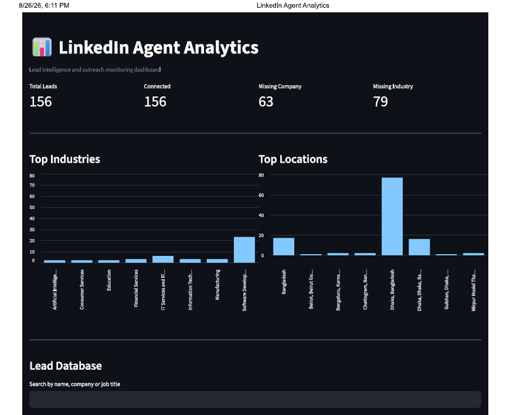

# linkedin-agent-analytics
# LinkedIn Agent Analytics Platform 🚀

An end-to-end analytics platform designed to collect, process, store, analyze, and visualize LinkedIn lead-generation and outreach activity.

The project demonstrates a complete data workflow using **FastAPI, PostgreSQL, Python, SQL, and Streamlit**, from data ingestion and database management to interactive analytics and dashboard visualization.

> **Privacy & Confidentiality Notice**
> Some information, personal data, account-level details, and assessment-related content have been anonymized, masked, or omitted for privacy and confidentiality. The screenshots and sample data included in this repository are intended for demonstration purposes only.

---

## 📌 Project Overview

The objective of this project was to build an analytics workflow around LinkedIn lead and outreach activity and transform the collected data into meaningful analytical insights.

The platform covers:

* Lead data collection and processing
* API-based data ingestion
* PostgreSQL database management
* SQL-based analytics
* Data transformation using Python/Pandas
* KPI and activity analysis
* Interactive Streamlit dashboard
* Structured project documentation

---

## 🏗️ Architecture

```text
                 LinkedIn Lead Activity
                          │
                          ▼
                    ┌──────────┐
                    │ FastAPI  │
                    │ API Layer│
                    └────┬─────┘
                         │
                         ▼
                  ┌──────────────┐
                  │ Data Pipeline│
                  └──────┬───────┘
                         │
                         ▼
                 ┌──────────────┐
                 │  PostgreSQL  │
                 │   Database   │
                 └──────┬───────┘
                        │
                        ▼
                ┌─────────────────┐
                │ Python / Pandas │
                │ SQL Analytics   │
                └────────┬────────┘
                         │
                         ▼
                  ┌────────────┐
                  │ Streamlit  │
                  │ Dashboard  │
                  └────────────┘
```

---

## 🛠️ Technology Stack

| Technology       | Purpose                                          |
| ---------------- | ------------------------------------------------ |
| **Python**       | Data processing, analytics and application logic |
| **FastAPI**      | Backend API and data ingestion                   |
| **PostgreSQL**   | Relational database and structured data storage  |
| **SQL**          | Data querying and analytical processing          |
| **Pandas**       | Data cleaning and transformation                 |
| **Streamlit**    | Interactive analytics dashboard                  |
| **Git & GitHub** | Version control and project documentation        |

---

## 📊 Dashboard

The project includes an interactive **Streamlit analytics dashboard** for exploring LinkedIn lead and outreach activity.

### Dashboard Preview



> **Privacy Note:** Personal information, LinkedIn profile details, account-specific information, and other sensitive/assessment-related content have been hidden or anonymized in the dashboard preview.

---

## 🔍 Key Analytics

The platform can be used to analyze areas such as:

* Total leads
* Lead activity
* Lead status
* Agent-level activity
* Outreach activity
* LinkedIn URL availability
* Contact activity
* Lead prioritization
* Source distribution
* Engagement-related metrics

The analytical layer is designed to transform raw lead activity into structured information that can support monitoring and decision-making.

---

## 🗄️ Database

PostgreSQL is used as the primary database.

The database layer stores structured LinkedIn lead and activity information and provides the foundation for SQL-based analytics and dashboard reporting.

Example database components include:

```text
linkedin_profiles
linkedin_posts
```

SQL scripts are provided in the `sql/` directory.

---

## 🔄 Data Workflow

```text
1. Collect LinkedIn lead/activity data
              ↓
2. Validate and process incoming data
              ↓
3. Store structured data in PostgreSQL
              ↓
4. Transform and analyze using Python & SQL
              ↓
5. Generate analytical metrics
              ↓
6. Visualize results in Streamlit
```

---

## 📁 Project Structure

```text
linkedin-agent-analytics/
│
├── data/
│   └── raw/                  # Raw/sample data
│
├── logs/                     # Application and pipeline logs
│
├── sql/                      # Database schemas and SQL queries
│
├── src/
│   ├── activity_analysis.py
│   ├── dashboard.py
│   ├── test_connection.py
│   └── test_csv.py
│
├── tests/                    # Testing
│
├── screenshots/
│   └── dashboard.png
│
├── .env.example              # Environment variable template
├── .gitignore
├── requirements.txt
└── README.md
```

---

## ⚙️ Setup

### 1. Clone the repository

```bash
git clone https://github.com/YOUR_USERNAME/linkedin-agent-analytics.git
cd linkedin-agent-analytics
```

### 2. Create a virtual environment

```bash
python -m venv venv
```

Activate it on Windows:

```bash
venv\Scripts\activate
```

### 3. Install dependencies

```bash
pip install -r requirements.txt
```

### 4. Configure environment variables

Create a `.env` file based on `.env.example`.

Example:

```env
DB_HOST=localhost
DB_PORT=5432
DB_NAME=linkedin_analytics
DB_USER=postgres
DB_PASSWORD=your_password
```

**Never commit `.env` or any credentials to GitHub.**

### 5. Set up PostgreSQL

Create the required database and execute the SQL scripts provided in the `sql/` directory.

### 6. Run the Streamlit dashboard

```bash
streamlit run src/dashboard.py
```

---

## 🎯 Learning Outcomes

This project provided hands-on experience with:

* End-to-end analytics workflows
* REST API development
* PostgreSQL database management
* SQL analytics
* Data transformation with Python/Pandas
* Dashboard development with Streamlit
* Data pipeline concepts
* Data privacy and secure configuration
* Git/GitHub project documentation

---

## 👩‍💻 Author

**Bushra Mahfuzatul**
Data Analyst

Interested in **Data Analytics | Business Intelligence | SQL | Python | Data Engineering | Dashboarding**

---

## ⭐ Project

If you find this project useful or interesting, feel free to explore the repository and connect with me.
